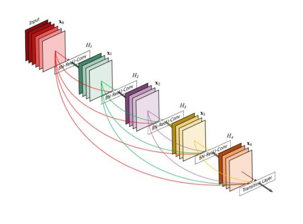

  

<h3 align="center">DenseNet - my implementation</h3>

---

 This is my own implementation of the <a href="https://arxiv.org/abs/1608.06993" rel="noopener">DenseNet</a>. I tried to make this implementation as close to the paper as my understanding allowed me. Please leave a comment and or suggestions (raise an issue)!
      

## Table of Contents

- [About](#about)
- [Contents](#content)
- [How to use the test script](#scriptUssage)
- [Authors](#authors)
- [ToDo list](#toDo)
- [Acknowledgments](#acknowledgement)

## About 

After reading the [DenseNet paper](https://arxiv.org/abs/1608.06993) I was very surprised for it being so simple and yet so powerfull. So I decided to make my own implementation of it and give it a try. 

I used [this Cifar-10 datase](https://www.kaggle.com/emadtolba/cifar10-comp) from kaggle to test the performance of my implementation. For that purpose, I trained a total of 4 DenseNet networks to the data; 2 of them were BC variants and the other to were none BC networks. The quick comparison I did on these four networks can be found in [this jupyter notebook](performance_Analysis/Cifar-10_performanceTest.ipynb).

A test script may be found [here](https://github.com/armhzjz/DenseNet/tree/master/tests/Cifar-10). I used this test script to ensure the implementation works also out of the context of kaggle notebooks (in case you want to try the script see [here](#scriptUssage)). It downloads the Cifar-10 dataset directly from its official webpage, prepares the training, validation and test data sets, trains a DenseNet model and evaluates it using the best parameters produced during its training. The execution of this script will take a considerable amount of time depending on the GPU hardware you use, so beware of this and don't get puzzled if it seems to take forever until the script is completely executed.

 Finally, a [kaggle kernel is found in here](https://www.kaggle.com/ahernandez1/mydensenet-implementation) in case the reader is interested in a cifar-10 evaluation (i.e. not only a rough comparison as the one provided in this repository).

***:** This DenseNet package can be installed via pip. You may find it [here](https://pypi.org/project/DenseNet-armhzjz/). This wheel package was created for testing purposes of this implementation and it is not likely to be mantained over future versions of python.

## Content 

* [DenseNet implementation as a Package](https://github.com/armhzjz/DenseNet/tree/master/DenseNet)
* [Quick performance analysis of different DenseNet networks on the Cifar-10 dataset](https://github.com/armhzjz/DenseNet/tree/master/performance_Analysis)
* [Cifar-10 training script (script used as test)](https://github.com/armhzjz/DenseNet/tree/master/tests/Cifar-10)

## How to use the test script 

This implementation works for python version 3.6.10. 
Pytorch is also required to be installed.
The test scripts requires also my DenseNet python package. It can be install via pip as follows: 

`pip install DenseNet-armhzjz`

It is recommended to use virtual environments (I personally like to use [Anaconda](https://anaconda.org/)). There is a '[densenet-test.yml](https://github.com/armhzjz/DenseNet/blob/master/tests/Cifar-10/densenet-test.yml)' file provided in this repository that you could use to install a new virtual environment with the packages needed for the test script to run. For example, if you use conda: 

`conda env create -f densenet-test.yml`

Note that this .yml file may specify more packages than the minimum required to run the script (I generated this yml file from the environment I use).

Once your environment has the DenseNet package and its dependencies you can simply run the script (i.e. `python3 Cifar-10.py`).

## Authors 

- [@armhzjz](https://github.com/armhzjz)

Any hint or advice on how this could be improved are welcome!

## ToDo list 

- [ ] Actually test the test script on Cifar-10 to make sure it runs as expected. Document the result of the test.
- [ ] Document the DenseNet package implementation
- [ ] Explain briefly the analysis made (in performance_Analysis folder)

## Acknowledgements 

While implementing my DenseNet solution I stumble upon [this other DenseNet](https://github.com/weiaicunzai/pytorch-cifar100) implementation from [@weiaicunzai](https://github.com/weiaicunzai). Even though my implmentation was almost finish (and very alike I must admit), it was useful to have another reference apart from the paper.
